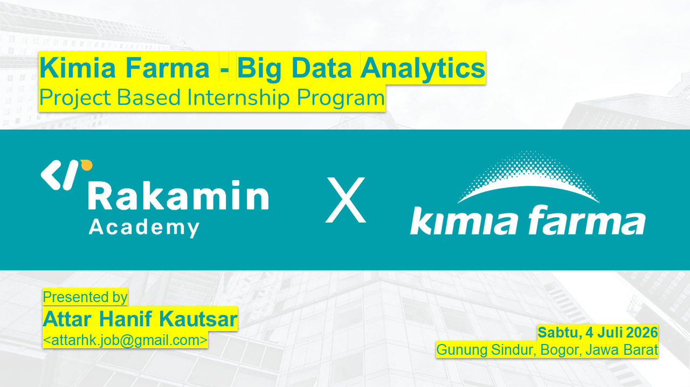

# 🏥 Analisis Performa Bisnis PT Kimia Farma Tbk (2020-2023)
# Project-Based Virtual Internship: Big Data Analytics by Rakamin Academy x Kimia Farma

 

## 📌 Latar Belakang Proyek
PT Kimia Farma Tbk. adalah pelopor industri farmasi di Indonesia yang kini telah berkembang menjadi perusahaan penyedia layanan kesehatan terintegrasi dari hulu ke hilir. Proyek ini bertujuan untuk mengevaluasi kinerja bisnis Kimia Farma secara menyeluruh dari tahun 2020 hingga 2023. 

Tantangan utamanya adalah mengintegrasikan ratusan ribu baris data historis yang tersebar di berbagai tabel (transaksi, inventori, produk, dan cabang) menjadi satu sumber kebenaran tunggal (*Single Source of Truth*). Data ini kemudian ditransformasikan untuk menggali metrik finansial krusial dan divisualisasikan agar manajemen dapat dengan cepat mengidentifikasi tren pendapatan serta anomali kualitas layanan di berbagai cabang.

## 🛠️ Tools & Technologies
*   **Database:** Google BigQuery (Data Warehousing, SQL Processing)
*   **Data Visualization:** Google Looker Studio (Dashboarding)
*   **Documentation & Version Control:** GitHub, Microsoft PowerPoint

## 📂 Dataset Dictionary
Analisis ini didasarkan pada integrasi 4 tabel relasional utama:
1.  `kf_final_transaction`: Memuat histori transaksi, nama pelanggan, harga, persentase diskon, dan rating transaksi.
2.  `kf_inventory`: Memuat data ketersediaan stok (*opname stock*) produk di setiap cabang.
3.  `kf_kantor_cabang`: Memuat detail demografis (kota/provinsi) dan rating fisik fasilitas cabang.
4.  `kf_product`: Memuat master produk, kategori, dan harga dasar.

*(Catatan: Dataset terbatas dimiliki oleh peserta saja, tidak disebarluaskan karena hak milik Kimia Farma).*
---
## 🚀 Dokumentasi Langkah-Langkah Pengerjaan

### Tahap 1: Data Importing
Dataset mentah berformat `.csv` diunggah ke Google BigQuery. Proyek baru dibuat dengan nama `Rakamin_KF_Analytics` dan dataset `kimia_farma` disiapkan sebagai wadah utama.

### Tahap 2: Data Transformation (SQL Query)
Tabel analisa dibuat menggunakan klausa `WITH` (Common Table Expression) untuk menggabungkan keempat tabel melalui `LEFT JOIN` dengan tabel transaksi sebagai tabel fakta (poros utama).

Transformasi *business logic* yang dilakukan meliputi:
1.  **Agregasi Laba Bersyarat:** Menggunakan fungsi `CASE WHEN` untuk menentukan persentase laba kotor (*gross profit margin*) secara dinamis berdasarkan tiering harga (10% hingga 30%).
2.  **Kalkulasi Finansial:** Menghitung `nett_sales` (harga setelah diskon) dan `nett_profit` (keuntungan dari nett sales dikali persentase laba).

*(Catatan: Syntax SQL lengkap dapat dilihat pada file `Tabel Analisa - BigQuery.sql` di repositori ini).*

### Tahap 3: Data Visualization
Hasil *query* disimpan sebagai *View* di BigQuery dan dihubungkan secara *live* ke Google Looker Studio untuk perancangan *dashboard*.

---

## 📊 Akses Dashboard & Video Penjelasan
*   **🔗 Link Dashboard:** (https://datastudio.google.com/reporting/6449fff4-70b1-4e78-9d22-40e664dc1b1f)
*   **🎥 Link Video Presentasi:** [Link Presentasi YouTube]

---

## 💡 Key Insights & Business Recommendations

Berdasarkan *dashboard* yang telah dibangun, berikut adalah temuan utama dan rekomendasi strategis untuk perusahaan:

### 1. Kinerja & Dominasi Pasar
*   **Insight:** Selama 2020-2023, Kimia Farma mencetak total pendapatan sebesar **Rp 321,17 Miliar** dengan tren fluktuasi siklikal yang stabil. Jawa Barat memimpin dominasi transaksi nasional (>198 ribu transaksi) dengan kontribusi omzet mencapai ~Rp 95 Miliar.
*   **Rekomendasi (Core Strategy):** Memperkuat sistem *supply chain* dan manajemen logistik di wilayah Jawa Barat (konsolidasi tim gudang dan lapangan) untuk memastikan tidak ada kehilangan potensi penjualan (*lost sales*) akibat kehabisan stok.

### 2. Anomali Kualitas Pelayanan
*   **Insight:** Ditemukan kesenjangan ekspektasi pelanggan di 5 cabang spesifik (di antaranya Pematangsiantar dan Jambi). Cabang-cabang ini memiliki rating fasilitas fisik yang sangat mewah/tinggi (>4.7), namun rating transaksi dari pelanggan anjlok (<4.0). Ini mengindikasikan masalah pada layanan tak kasat mata (seperti antrean kasir, ketersediaan obat, atau keramahan staf).
*   **Rekomendasi:** Melakukan audit operasional secara menyeluruh dan *retraining Standard Operating Procedure* (SOP) khusus pada 5 cabang prioritas tersebut dengan melibatkan Manajer Area terkait.

### 3. Potensi Ekspansi Jangka Panjang
*   **Insight:** Pemetaan sebaran profit menunjukkan pasar di luar Jawa (seperti wilayah tertentu di Sumatera dan Indonesia Timur) belum tergarap maksimal.
*   **Rekomendasi:** Mengejar pangsa pasar 3T (Tertinggal, Terdepan, Terluar) tidak harus dengan investasi gerai fisik baru yang mahal. Kimia Farma dapat berinovasi melalui penguatan *telemedicine*, layanan apotek *Drive-Thru*, atau perekrutan agen penjualan regional.

---
**Author:**
Attar Hanif Kautsar
*   **Email:** attarhk.job@gmail.com
*   **LinkedIn:** [https://www.linkedin.com/in/attarhk/]
